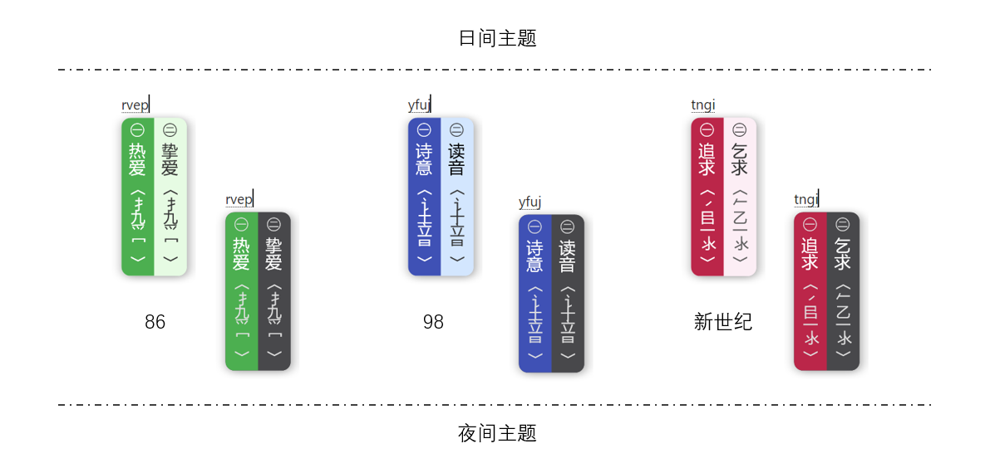
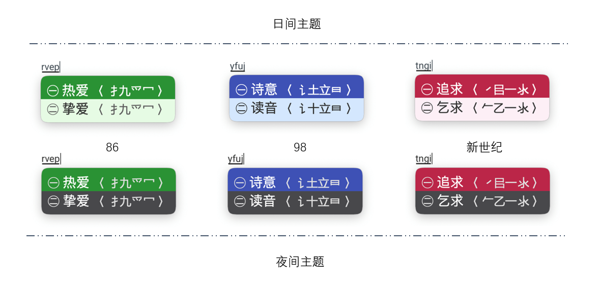

## 初次安装

如果您已经完成**中书君**的安装，在正式打字之前，还需要完成以下几个操作：

- 确认您的电脑已经安装了[小狼毫](https://rime.im/download/)软件，如果还没有安装，请前往官网下载安装包，并完成安装；
- 若已完成小狼毫的安装，请重启**中书君**，然后转到设置页面，点击**初始化**按钮。此操作将在线下载五笔引擎配置文件包；
- 完成上述两个操作后，此时您的电脑就可以正常地使用五笔了。默认的方案是86五笔。您可以通过首页的八卦符号切换五笔版本。旋转的八卦符号表示当前正在使用的版本。

## 预览

## 打字表现

### Windows 端表现

### MacOS 端表现

## 介绍

**【中书君】** 是一款针对于 Rime 输入法引擎的管理器，最初的愿望是希望它能支持五笔输入方案的属性、词库等方面的管理。最终还希望它能完美地兼容更多输入方案（如简拼、双拼等）的管理，以提升 Rime 的使用体验。

目前，本软件还处于研发阶段，相应功能会持续更新，如有特殊需求，可提交 ISSUES.

如果对您有帮助，请帮我在右上角点个星，谢啦~~~ ⭐

## 软件架构

|  关键技术   | 描述  |
|  ----  | ----  |
| 开发语言  | C# |
| 开发框架  | .NET Core / WPF |
| 框架版本  | .NET 6 |
| 开发工具  | Visual Studio 2022 |
| 设计模式  | Mvvm / CommunityToolkit.Mvvm |
| 第三方库  | Log4.net / CommunityToolkit.Mvvm / Newtonsoft.Json / YamlDotNet / Behaviossr.Wpf |
| 打包环境  | Inno Setup |

### 方案地址

- 📌 https://gitee.com/hi-coder/rime-wubi
- 📌 https://github.com/myshiqiqi/rime-wubi

## 捐赠 🌻

> 感谢您选择并使用这款开源软件！您的信任与支持是我持续前进的动力。  
> 开源软件的研发与维护离不开开发者的辛勤付出与无私奉献。为了保持软件的持续更新与优化，恳请您在能力范围内考虑对本项目进行捐赠。  
> 您的每一份捐赠，都将直接用于软件的开发、测试、维护以及优化，帮助更多用户享受到更好的使用体验。  
> 您可以选择通过支付宝、微信等在线支付平台进行捐赠，捐赠金额不限，您的每一份心意我都将倍加珍惜。  
>  再次感谢您的支持与厚爱！祝您生活愉快，工作顺利！  
> 空山明月 敬上

### 捐赠记录

|日期|捐赠者|金额|留言|
| ----- | ----- | ----- | ----- |
|2024-5-6|**飞|30.00|请保持维护和更新，我一直在用新世纪的码表|
|2024-5-7|天青色|10.00|空山佬的方案让我再次爱上了五笔|
|2024-5-8|An|5.00|无|
|2024-5-8|*|50.00|无|
|2024-05-15|YG777|66.00|无|
|2024-05-16|悟空|30.00|无|
|2024-05-18|WIIMOO|120.00|怎能辜负了这群为爱发电的战士，记得我的五笔拼音长语句输入哦|
|2024-5-20|曵景成文|33.00|共攀书山，致敬前行者|
|2024-5-31|*宇|5.00|无|
|2024-06-12|*洋|30.00|无|

## QQ群

欢迎您的加入！

